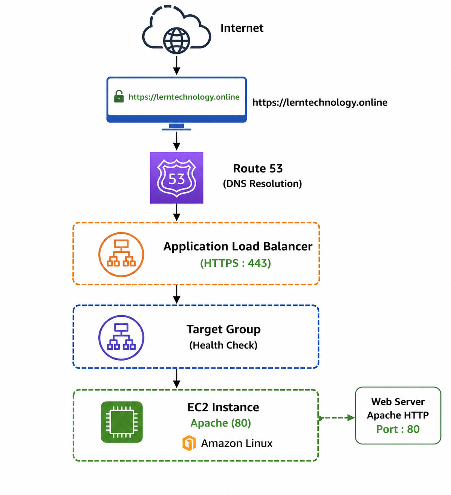

## Project: Host a Website on AWS Using EC2, ALB, Route 53 and SSL
**Objective** 
Deploy a website on an EC2 instance and make it accessible securely through a custom domain using HTTPS. 
## **Architecture**

## Services Used
- Amazon EC2
- Application Load Balancer (ALB)
- Target Group
- Route 53
- AWS Certificate Manager (ACM)
- Security Groups
- Apache HTTP Server

## Step 1: Launch EC2 Instance
**Launch 2 or more Amazon Linux EC2 instance.** 
**Install Apache:** 
sudo yum install httpd -y 
**Start Apache:** 
sudo systemctl start httpd
sudo systemctl enable httpd
**Verify:** 
systemctl status httpd 
**Create sample page:** 
- echo "<h1>AWS HTTPS Project - Bijay</h1>" | sudo tee /var/www/html/index.html  
**Test the website:** 
curl localhost 

## Step 2: Create Target Group
**Navigate:** 
EC2 → Target Groups 
**Create:** 
Target Type: Instances 
Protocol: HTTP 
Port: 80 
Health Check Path: /index.html 
**Register EC2 instance.** 
**Verify:** 
Health check should be healthy 
**Note:-** Its checks the website reachability to consider server healthy. 

## Step 3: Create Application Load Balancer

